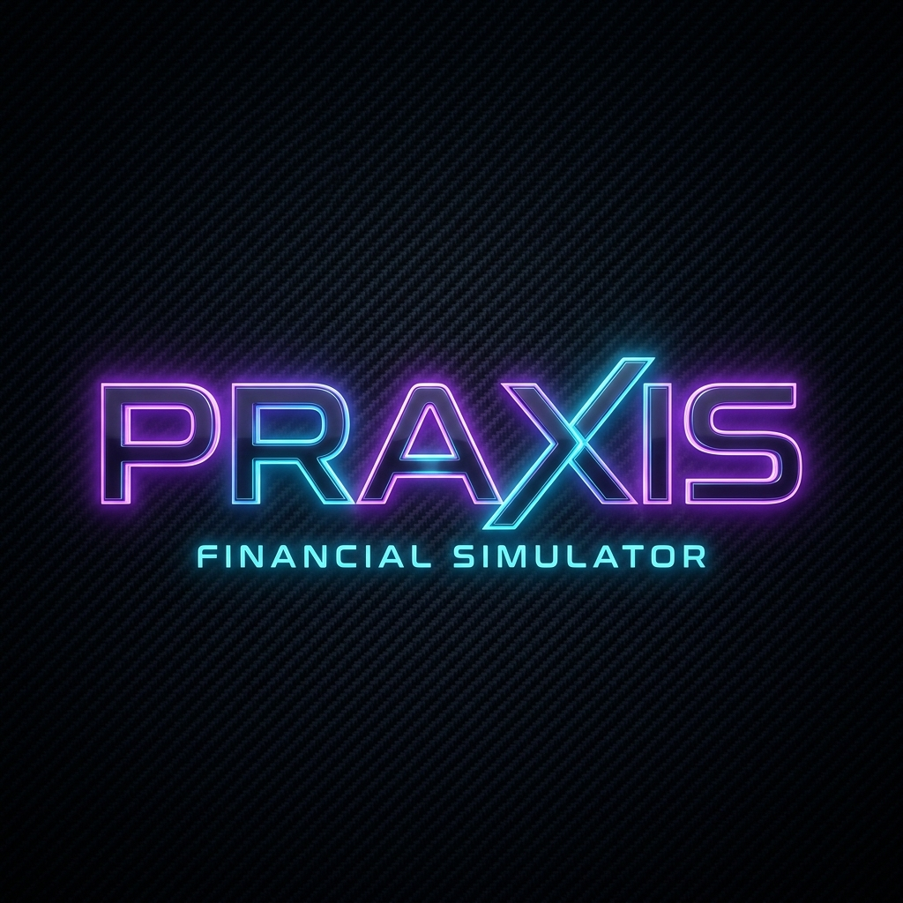

<div align="center">

<br />

<!--  -->

<br />

<table border="0">
<tr>
<td>

```
██████╗ ██████╗  █████╗ ██╗  ██╗██╗███████╗
██╔══██╗██╔══██╗██╔══██╗╚██╗██╔╝██║██╔════╝
██████╔╝██████╔╝███████║ ╚███╔╝ ██║███████╗
██╔═══╝ ██╔══██╗██╔══██║ ██╔██╗ ██║╚════██║
██║     ██║  ██║██║  ██║██╔╝ ██╗██║███████║
╚═╝     ╚═╝  ╚═╝╚═╝  ╚═╝╚═╝  ╚═╝╚═╝╚══════╝
```

</td>
</tr>
</table>

### The Financial Simulator That Actually Teaches You Something.

[](https://praxis-hub.vercel.app)
[](https://praxis-ycda.onrender.com/health)
[](https://github.com/shlokkokk/PRAXIS)
[](https://react.dev)
[](https://groq.com)

<br />

> *You'll make financial mistakes in real life. This is the safe place to make them first.*

<br />

</div>

---

## The Problem Nobody Wants to Talk About

**81% of young people want financial guidance. 19% actually get it.**

Here's what happens to the other 62%: they learn by losing.

They take on credit card debt at 24% APR because nobody explained compound interest the way that actually sticks. They don't invest in their 20s because the stock market "seems risky." They panic-sell during a downturn and lock in losses that take years to recover from. They get a raise and lifestyle inflate instead of building wealth.

By the time they figure it out, they've paid an expensive, irreversible real-world tuition.

**Financial literacy isn't a knowledge problem. It's a practice problem.**

You can't get better at something you've never done. PRAXIS gives you the reps, without the consequences.

---

## What PRAXIS Is

PRAXIS is an AI-native financial simulator. You create a **Financial Twin**, a high-fidelity digital version of yourself, and put it through real financial crossroads: a summer hustle, your first paycheck, a market crash, an unexpected $10,000 windfall. At every decision point, three specialized AI agents step in and *debate each other* about what you should do.

Not a quiz. Not a calculator. Not a textbook. A simulation.

Every decision you make updates your twin's net worth, adjusts a 10-year wealth projection, and feeds into a mastery score across six financial domains. You walk away having actually *thought through* the trade-offs, and that is the whole point.

---

## How It Works

```
You → Build Your Twin → Navigate Scenarios → AI Council Debates → You Choose → Consequences Reveal → Repeat
```

**Step 1: Create Your Financial Twin**
Input your real numbers: income, expenses, savings, debt. Answer a personality assessment that determines your risk tolerance, behavioral biases, investment instincts, and financial archetype.

**Step 2: Enter a Scenario**
Choose a real financial crossroad from the scenario library. Each one spans multiple years and contains branching decision nodes.

**Step 3: Consult the Council**
Before every major decision, three AI agents analyze your specific situation and argue about what you should do. Positions are formed, challenged, rebutted, and synthesized.

**Step 4: Make the Call**
You decide. The outcome updates your twin's financial state: net worth, health score, mastery breakdown. The long-term projection shifts. Some choices take years to play out.

**Step 5: Learn the Pattern**
Across multiple scenarios, you start seeing your own behavioral tendencies in the mastery radar. Where you're strong. Where you have blind spots. What kind of financial animal you actually are.

---

## 🏛️ Feature Deep-Dive

### 🤖 The Multi-Agent AI Council

The centerpiece of PRAXIS. When you hit a decision, three agents, each with a distinct psychological framework, independently analyze your scenario, then argue with each other.

| Agent | Worldview | What They're Watching For |
|-------|-----------|--------------------------|
| 🛡️ **The Conservator** | Safety above all | Liquidity ratios, downside risk, emergency cushion, "what if everything goes wrong" |
| 📈 **The Grower** | Time is the variable that matters | Compound math, opportunity cost, tax-advantaged growth, every month of delay costs you |
| 🧠 **The Behaviorist** | Your psychology is the real risk | Loss aversion, anchoring bias, lifestyle inflation, status quo paralysis |

**The Three-Phase Deliberation Protocol:**

1. **Phase I: Independent Analysis**: Each agent reads the scenario and forms a position without seeing the others.
2. **Phase II: Cross-Examination**: Agents directly challenge each other's logic. The Grower attacks the Conservator for fear-based thinking. The Conservator fires back about average returns hiding catastrophic years. The Behaviorist cuts through both.
3. **Phase III: Synthesis**: A unified final recommendation with a confidence score, explicit trade-offs, and points of genuine disagreement between the agents.

Built on **Llama 3.3 70B Versatile** via **Groq Cloud**. Full fallback to a deterministic mock council if the backend is offline so the app *never* breaks.

---

### 🌌 The 3D Financial Galaxy

Your portfolio rendered as a living, physics-driven solar system in Three.js.

- **Planets** represent asset classes: stocks, bonds, crypto, cash, real estate.
- **Orbital physics** tied to real-world volatility: high-risk assets orbit faster and more erratically.
- **Debt Octahedron**: a chaotic geometric mass at the center that physically warps the orbits of your growth planets, visualizing the gravitational drag of interest and leverage.
- **Mouse-reactive particle field**: 140 violet particles form a dynamic constellation that responds to cursor movement, with proximity glow and fluid repulsion physics.

---

### 🧬 Financial Twin DNA

Two ways to view your Financial Identity Matrix:

**Galaxy View**: the 3D visualization above.

**DNA View**: a structured breakdown of who you are financially:
- **Archetype**: five profiles: Guardian, Builder, Explorer, Strategist, Visionary. Each with a distinct description, icon, and behavioral prediction.
- **Portfolio Allocation**: auto-generated strategy bars based on your risk profile.
- **Psychological Anchors**: four scored traits: Risk Tolerance, Delayed Gratification, Research Patience, Automation Comfort.
- **Mastery Radar**: a live hexagonal radar chart tracking six skill domains: Budgeting, Investing, Debt Management, Behavioral Awareness, Tax Optimization, Risk Management.

---

### 📊 Live Market Intelligence Ticker

Real economic data embedded directly into your dashboard:

| Data Source | What It Shows |
|-------------|--------------|
| **Alpha Vantage** | S&P 500 (SPY) price, daily change, % change |
| **Alpha Vantage** | Bitcoin (BTC-USD) price, daily change, % change |
| **FRED API** | Federal Funds Rate (current) |
| **FRED API** | CPI Inflation (year-over-year %) |

A green `LIVE` dot appears when data is confirmed fresh. A `SYNC` button manually triggers a refresh. 5-minute cache prevents rate-limiting on free tier keys.

---

### 🎮 The Scenario Engine

Four fully realized financial scenarios, each with multiple decision nodes across a multi-year timeline:

| Scenario | Premise | Stakes | Difficulty |
|----------|---------|--------|------------|
| 🎓 **The Summer Hustle** | Ages 16 to 19: first job through freshman year | Car payments, prom, student loans, credit traps | Beginner |
| 💼 **The First Paycheck** | First real job, five hundred dollars left over | 401k vs emergency fund vs student debt | Beginner |
| 📉 **The Market Crash** | Portfolio down 30% overnight | Panic sell, buy the dip, or hold? | Intermediate |
| 💰 **The Windfall** | Unexpected $10,000 drops in your lap | Start a business, pay off debt, invest all of it? | Intermediate |

Each node includes:
- A narrative context paragraph
- 2 to 4 decision options with labels and descriptions
- Hidden projections and outcome data revealed after the choice
- Short-term result plus long-term projection text
- "Lessons learned" surfaced post-decision
- Score impact mapped to specific mastery categories

---

### 📚 Quantum Lexicon

An in-app financial glossary, always one click away. Over 20 terms defined clearly:

*Compound Interest, Index Fund, Dollar-Cost Averaging, Emergency Fund, 401(k), Roth IRA, Net Worth, Debt-to-Income Ratio, Asset Allocation, Diversification, Inflation, Opportunity Cost, Expense Ratio, Passive Income, Liquidity, Capital Gains, Tax-Loss Harvesting, Bear Market, Bull Market, and more.*

Opens as a smooth glassmorphic modal with scroll-lock so you don't lose your place in the simulation.

---

### 🔊 Tactical Audio System

Synthesized audio feedback on every interaction: subtle hover tones, satisfying click sounds on decisions, distinct tones for different interaction types. Toggle-able from the nav. Implemented from scratch using the Web Audio API, no external library.

---

### ⚙️ System Intelligence Indicators

The nav bar has a live 3-state status badge that updates every 8 seconds:

| Badge | Color | Meaning |
|-------|-------|---------|
| `QUANTUM_COUNCIL_ONLINE` | 🟢 Emerald | Backend connected, Groq API live |
| `API_CONNECTED · NO_AI` | 🔵 Cyan | Backend reachable, AI key issue |
| `HEURISTIC_MOCK_ACTIVE` | 🟡 Gold | Backend offline, running mock fallback |

If the backend needs to cold-start, an amber pill banner appears below the nav after 4 seconds: *"Backend is starting up. This can take up to 30s. Hang tight."* Auto-dismisses the moment the connection is established.

---

## 🚀 Try It Right Now

No setup. No account. No install.

**→ [praxis-hub.vercel.app](https://praxis-hub.vercel.app)**

> The AI backend runs on Render's free tier. First load after inactivity takes ~30 seconds to wake up. The app displays a banner and runs in mock mode while this happens. Everything else works immediately.

---

## 🛠️ Run It Locally

### What You Need
- Node.js 18+
- Python 3.10+
- Free [Groq API key](https://console.groq.com) for live AI council
- Optional: [FRED API key](https://fred.stlouisfed.org/docs/api/api_key.html) for live macro data

### Setup

```bash
# 1. Clone
git clone https://github.com/shlokkokk/PRAXIS.git
cd PRAXIS

# 2. Frontend
npm install
npm run dev
# Running at http://localhost:5173

# 3. Backend (new terminal)
cd api
pip install -r requirements.txt

# Create .env
echo GROQ_API_KEY=your_groq_key_here > .env
echo FRED_API_KEY=your_fred_key_here >> .env

# Start server
uvicorn main:app --reload --port 8000
# Running at http://localhost:8000
```

### Verify Everything

```bash
# Backend health (should show ai_enabled: true)
curl http://localhost:8000/health

# Market data (should return fedRate and inflation)
curl http://localhost:8000/api/market-data
```

> No API key? That's fine. PRAXIS automatically falls back to a rich deterministic mock council so you get the full experience without any keys.

---

## 🗂️ Project Structure

```
PRAXIS/
├── api/
│   ├── agents/              # The three AI agent prompt personas
│   ├── orchestrator.py      # 3-phase deliberation logic + Groq calls
│   ├── models.py            # Pydantic schemas (request/response contracts)
│   ├── main.py              # FastAPI + CORS + FRED market data
│   └── requirements.txt
│
├── src/
│   ├── components/
│   │   ├── galaxy/          # Three.js 3D portfolio universe
│   │   ├── council/         # AI deliberation panel + loading states
│   │   ├── simulation/      # Decision panel, outcome reveal, timeline
│   │   ├── glossary/        # Quantum Lexicon modal
│   │   └── ParticleField.tsx # Mouse-reactive canvas background
│   │
│   ├── data/
│   │   └── scenarios.ts     # All 4 scenarios + full decision trees
│   │
│   ├── hooks/
│   │   └── useMarketData.ts # Live data fetching + 5min cache
│   │
│   ├── pages/
│   │   ├── Landing.tsx      # Entry point
│   │   ├── Onboarding.tsx   # Twin creation flow
│   │   ├── Dashboard.tsx    # Command center
│   │   └── Simulation.tsx   # Scenario + council + outcome engine
│   │
│   ├── store/
│   │   └── useStore.ts      # Zustand state + localStorage persistence
│   │
│   └── config.ts            # Environment-agnostic API URL
│
├── vercel.json              # Vercel SPA rewrite config
├── render.yaml              # Render Python service config
└── README.md
```

---

## 🧠 Tech Stack

| Layer | Technology | Why |
|-------|-----------|-----|
| UI Framework | React 19 + TypeScript | Type-safe, fast, component-driven |
| 3D Engine | Three.js via React Three Fiber | WebGL portfolio galaxy with physics |
| Animations | Framer Motion | Smooth transitions throughout |
| State | Zustand + localStorage | Persistent financial twin between sessions |
| Charts | Recharts | Wealth projection + mastery radar |
| Audio | Web Audio API | No-library synthesized feedback |
| Backend | FastAPI + Uvicorn/Gunicorn | Async Python, production-ready |
| AI Models | Llama 3.3 70B via Groq Cloud | Fast inference for multi-agent debate |
| Schema | Pydantic v2 | Strict JSON contracts between agents and frontend |
| Market Data | Alpha Vantage + FRED API | Real stock and macro data |
| Frontend Host | Vercel | Auto-deploy from GitHub, global CDN |
| Backend Host | Render | Python web service, zero config |

---

## 💬 Devpost Submission Answers

**What issue are you solving?**

Young people learn finance by making expensive real-world mistakes: bad debt, delayed investing, panic decisions during market downturns. By the time they understand the system, they've already paid the tuition. Traditional financial education is passive; it gives you the theory but never lets you practice. PRAXIS closes that gap.

**How does your project address it?**

PRAXIS makes financial learning active, personal, and consequence-driven. You build a Financial Twin from your real numbers and risk personality. You navigate branching scenarios covering real decisions real people face. An AI council debates every choice from three distinct financial philosophies, showing you the trade-offs rather than a single "correct" answer. Every decision updates your twin's net worth, adjusts a 10-year projection, and contributes to a mastery radar across six financial domains. You're not reading about compound interest. You're watching your twin's wealth projection shift because you chose the wrong option at 22. That is how instinct gets built.

**What was the hardest part of the build?**

The multi-agent deliberation system. Getting three AI agents to do more than just answer independently, to *argue with each other*, find actual flaws in opposing logic, and converge on a synthesis, required careful prompt engineering for each agent's psychological persona to stay consistent across wildly different scenarios. On top of that, the entire deliberation output had to be structured as a strict Pydantic schema so the frontend could reliably parse three-way debates, rebuttals, and confidence scores in real time. Getting that pipeline stable, fast enough to feel live, and gracefully falling back to mocks when the backend is cold was the real engineering challenge.

---

<div align="center">

<br />

```
Every financial decision you've ever avoided making. Make it here first.
```

<br />

**Built for West Hacks 2026 · Fintech & Education Track**

*Made by someone who believes financial literacy should be the default, not the exception.*

<br />

</div>
